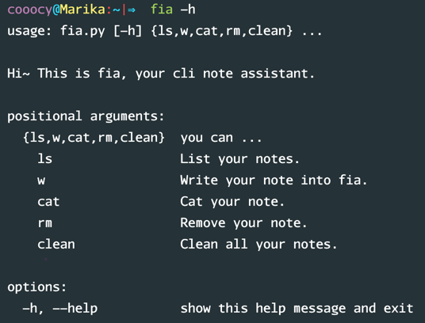
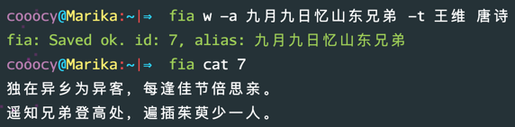
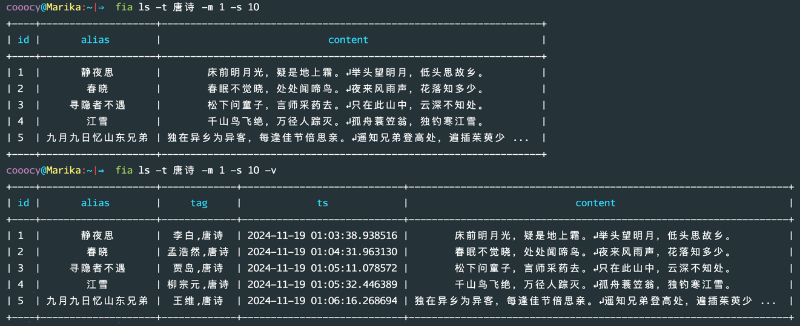

# Fia：您的命令行笔记助手

[English](README.md) | [中文](README.zh.md)

Fia 是一个简单高效的命令行笔记助手，旨在帮助你轻松管理笔记。

她允许你直接从终端创建、阅读、更新和删除笔记。

更棒的是，她可以直接操作你的系统剪贴板。





## 功能

- 创建笔记：快速记录想法并保存它们。
- 阅读笔记：通过 ID 或别名检索笔记，或使用过滤选项显示所有笔记。
- 删除笔记：移除特定笔记或一次性清除所有笔记。
- 剪贴板集成：自动从系统剪贴板读取和写入，方便操作。

## 安装和配置

要安装 Fia，只需克隆仓库并运行安装脚本：

```shell
git clone --depth=1 git@github.com:cooocy/fia.git
cd fia
python -m venv .venv
source .venv/bin/activate.fish
python -m pip install -r requirements.txt
```

然后修改配置文件 `config.yaml` 中的值。配置值支持使用 `${变量名}` 读取环境变量，
也支持使用 `${变量名:默认值}` 在环境变量不存在时指定默认值。

## 运行

在命令行执行 `fia --help`，参考帮助文档即可。

通过管道或文件重定向创建笔记：

```shell
printf 'hello\nworld\n' | fia w -a greeting
fia w -a changelog < CHANGELOG.md
```

显式传入 `-c/--content` 时，其优先级高于 stdin。未传入内容参数时，Fia
会优先读取重定向的 stdin；只有在交互式终端中才回退到系统剪贴板。stdin
内容会原样保存，包括尾部换行。

`fia cat` 会将笔记原文精确写入 stdout，不附加额外内容，因此可以安全地
重定向或通过管道交给其他命令：

```shell
fia cat greeting | wc -l
fia cat greeting > greeting.txt
```

```shell
fia --help

usage: fia.py [-h] {ls,w,cat,rm,clean} ...

Hi~ This is fia, your cli note assistant.

positional arguments:
  {ls,w,cat,rm,clean}  you can ...
    ls                 List your notes.
    w                  Write your note into fia.
    cat                Cat your note.
    rm                 Remove your note.
    clean              Clean all your notes.

options:
  -h, --help           show this help message and exit
```
